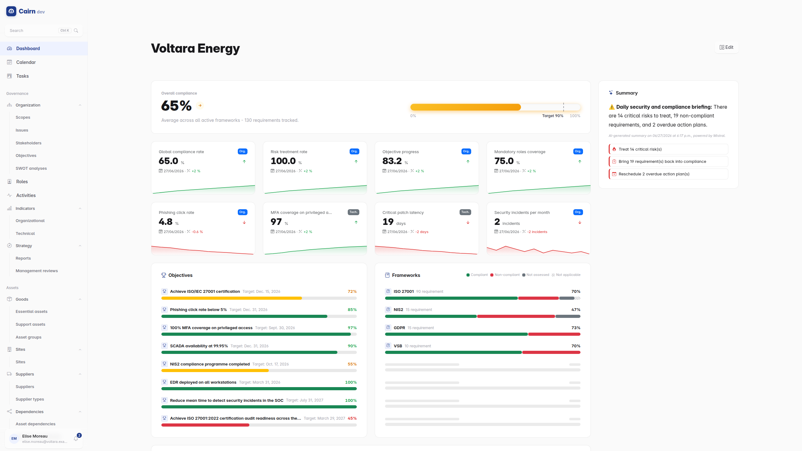

# Cairn

Open-source **Governance, Risk and Compliance** (GRC) platform.

Manage your organisation's security posture, track compliance with regulatory frameworks (ISO 27001, GDPR, NIS2, ...), and run structured risk assessments (ISO 27005, EBIOS RM) - all from a single, self-hosted application.



## What you get

- **Governance** : organisational scopes (with a Draft -> Definition -> Validation -> In force -> Review perimeter lifecycle), sites, strategic issues, stakeholders, objectives, SWOT, roles and activities
- **Assets** : essential and support assets with CIA valuation, dependencies, SPOF detection and a supplier registry (contacts, mapped addresses, a risk lifecycle and per-requirement compliance evaluation) with CSV bulk import, plus a **Documents** area starting with **contracts** (multi-party - suppliers and customer stakeholders, amendments, an attached PDF stored securely and a Draft -> Active -> Expired/Terminated lifecycle)
- **Risks** : ISO 27005 and EBIOS RM (ANSSI v1.5, workshops 0 to 5) assessments, threat and vulnerability catalogs, treatment plans and formal risk acceptance
- **Compliance** : frameworks, requirements, assessments, findings, action plans and inter-framework mappings, with Excel import and an optional **risk-driven applicability** mode (a framework derives each requirement's applicability automatically from its linked risks)
- **Steering** : a real-time, **configurable widget dashboard** (Apple-style edit mode with drag-to-reorder, two-dimensional `WxH` tile sizing with each tile's content auto-fitted to its size - no scroll, no empty space - reusable widgets (the same widget, e.g. a single-KPI **Indicator**, can be placed multiple times, each with its own settings), and an add/remove gallery, persisted per user) covering overall compliance, individual KPI indicators, an **Ask Cairn** LLM-synthesised daily briefing (a metrics snapshot summarised by the configured model, fetched asynchronously and cached), compliance by framework, active objectives, priority risks, upcoming deadlines, a conditional **ongoing audits** widget (shown only while an audit is running), the current-to-residual risk treatment flow chart and the current and residual risk matrices (each its own widget), plus **Section** headings (a bare, full-width title rendered straight on the page background) to group widgets into labelled sections; a unified To do / Doing / Done "Tasks" board aggregating action plans, treatment actions, audits and risk assessments; ISO 27001 management reviews; and PDF/DOCX/PPTX report generation (SoA, audit report, risk register, meeting minutes)
- **Trust Center** : a public, curated page to share your security posture (certifications and compliance level, subprocessors, security measures, downloadable documents), built directly into Cairn and optionally servable on a separate domain - an explicit, opt-in curation layer so internal GRC data never leaks
- **Ask Cairn (optional)** : natural-language questions in the command palette ("Which decisions were made at the last management review?"), answered by a pluggable LLM provider (Mistral AI by default; OpenAI / any OpenAI-compatible endpoint; Claude; self-hosted Ollama) that cites real records and enforces your permissions, with thumbs up/down feedback that admins can export to improve the assistant. Its name is customisable in the company settings (defaults to "Ask Cairn")

Everything is bilingual (English/French), audit-ready (full change history, versioning, lifecycle workflows with approvals) and access-controlled (role-based permissions, scope-based tenancy, passkey login).

Beyond the web UI, every feature is also available through a [REST API](docs/api.md) and a built-in [MCP server](docs/mcp-server.md), so scripts and AI assistants can work with your GRC data directly.

## Quick start

With [Docker](https://docs.docker.com/get-docker/) installed:

```bash
cp .env.example .env
docker compose up --build
```

Then open [http://localhost:8000](http://localhost:8000). On a fresh database a **first-run onboarding screen** greets you: it shows the database migration state and lets you either **start from scratch** (create the first administrator account) or **start with sample data** (load the demo dataset behind a live progress bar, then sign you in automatically). See [first-run onboarding](docs/modules/m0-accounts/onboarding.md). You can still create an admin from the CLI instead (`docker compose exec web python manage.py createsuperuser`).

Prefer pure Python for debugging? Cairn also runs with no Docker and no external service using [mise](https://mise.jdx.dev/) (SQLite + in-memory channels), with ready-to-use VS Code launch configurations - see [running in pure Python for debugging](docs/installation.md#option-3--run-in-pure-python-for-debugging-mise).

To run the published image without cloning the repository, and for production notes (scheduled commands), see the [installation guide](docs/installation.md).

## Documentation

| Document | Contents |
| -------- | -------- |
| [Installation guide](docs/installation.md) | Docker setup (from source or published image), pure-Python debugging with mise, scheduled commands |
| [Features](docs/features.md) | Detailed feature reference for every module |
| [REST API](docs/api.md) | Base paths, authentication, conventions |
| [MCP server](docs/mcp-server.md) | Endpoints, OAuth 2.0, full tool reference |
| [Module specifications](docs/modules/README.md) | Business rules and per-entity contracts |

## Tech stack

Django 5.2 LTS, PostgreSQL 16, Django REST Framework, Django Channels + Redis (real-time), Bootstrap 5.3 + HTMX + Apache ECharts (frontend), Docker. Optional: Mistral AI, OpenAI / OpenAI-compatible endpoints, Claude (Anthropic), or self-hosted Ollama (Ask Cairn assistant).

## Licence

MIT
