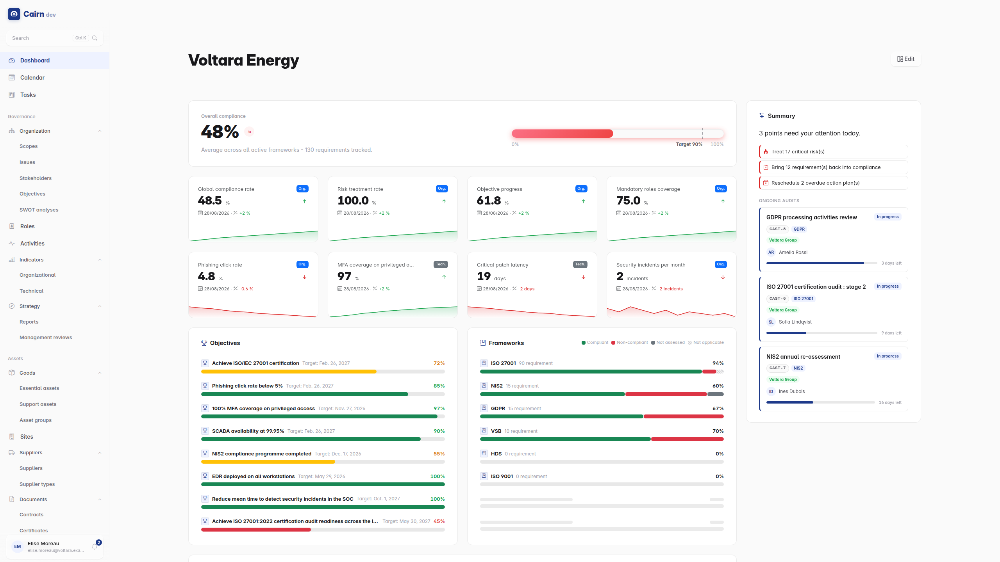

# Cairn

**Governance, Risk and Compliance, self-hosted.**

Track your compliance with ISO 27001, GDPR, NIS2 and the rest, run structured
risk assessments, and handle security incidents with the evidence trail a
regulator will ask for. One application, one container, your own infrastructure.

[](https://github.com/frousselet/cairn/actions/workflows/tests.yml)
[](https://hub.docker.com/r/frousselet/cairn)
[](LICENSE)



## Quick start

```bash
cp .env.example .env
docker compose up --build
```

Open [localhost:8000](http://localhost:8000). A first-run screen offers to set
up your company, or to load the **Voltara Energy** demo dataset so you can look
around a populated instance straight away.

No Docker? Cairn also runs on pure Python with SQLite for debugging. See the
[installation guide](docs/technical/installation.md).

## What it covers

| Module | What you do with it |
| --- | --- |
| **Governance** | Scopes, strategic issues, stakeholders, objectives, SWOT, roles and activities : the ISO 27001 clause 4 context |
| **Assets** | Essential and support assets with CIA valuation, dependency mapping, SPOF detection, suppliers, contracts and certificates |
| **Risks** | ISO 27005 and EBIOS RM (ANSSI v1.5, workshops 0 to 5), a three-level register, treatment plans and formal acceptance |
| **Compliance** | Frameworks and requirements, audits, an organisation-wide nonconformity register, action plans and inter-framework mappings |
| **Incidents** | Event intake, incident handling, sealed evidence under chain of custody, and statutory notification clocks (GDPR, NIS2, DORA) |
| **Trust Center** | A public, curated page for your security posture, optionally on its own domain |
| **Steering** | A configurable widget dashboard, a unified tasks board, management reviews, and PDF / DOCX / PPTX / XLSX reports |

## What makes it different

**Governance is enforced, not suggested.** Every record runs a lifecycle whose
step decides whether it counts in reports, whether anything may link to it, and
whether it can be deleted at all. There is no status dropdown : a state change
is a permissioned transition that leaves a trail.

**Everything is an API.** Every feature is reachable through the
[REST API](docs/reference/rest-api.md) and a built-in
[MCP server](docs/reference/mcp-server.md), so scripts and AI assistants work
with your GRC data directly, under the caller's own permissions.

**Built for the audit.** Full change history on every record, versioning,
scope-based tenancy, role-based permissions and passkey login. Bilingual
throughout, English and French.

**Optional AI, off by default.** [Ask Cairn](docs/user-guide/ask-cairn.md)
answers questions in plain language and cites real records. Point it at Mistral,
OpenAI, Claude, or your own Ollama so nothing leaves your infrastructure.

## Documentation

The full documentation lives in the **[wiki](https://github.com/frousselet/cairn/wiki)**,
built from [`docs/`](docs/README.md).

| | |
| --- | --- |
| [User guide](docs/user-guide/README.md) | Using the platform, module by module |
| [Technical](docs/technical/README.md) | Install, configure, secure, operate |
| [SDK](docs/sdk/README.md) | Extend it : widgets, entities, endpoints, tools |
| [Reference](docs/reference/README.md) | Endpoints, MCP tools, permissions, settings |
| [Specifications](docs/specs/README.md) | The contract each module is held to |

## Tech stack

Django 5.2 LTS, PostgreSQL 16, Django REST Framework, Channels and Redis,
Bootstrap 5.3 with HTMX and Apache ECharts. No JavaScript build step.

## Licence

Cairn is free software under the **GNU Affero General Public License, version 3
or later** ([`AGPL-3.0-or-later`](LICENSE)).

The AGPL is a network copyleft licence : run a modified version and make it
available over a network, and you must offer those users the corresponding
source. Distributing a modified version triggers the same obligation.

Every source file carries an `SPDX-License-Identifier: AGPL-3.0-or-later`
header. Third-party files under `static/vendor/` keep their own upstream
licences and are not covered by this notice.

### Trademarks

The licence covers the source code. It grants no right to the **Cairn** name,
the logo or the visual identity in [`docs/brand/`](docs/brand/brand-guidelines.md).
A public fork or a hosted derivative must use a different name and its own
branding.
