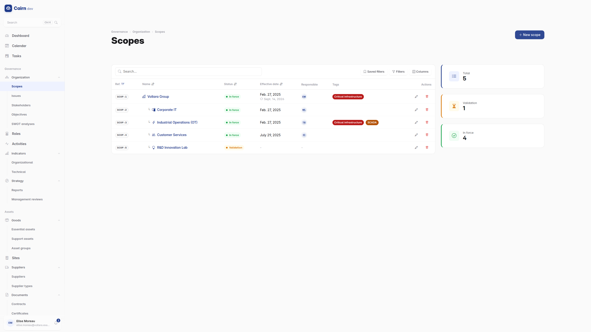
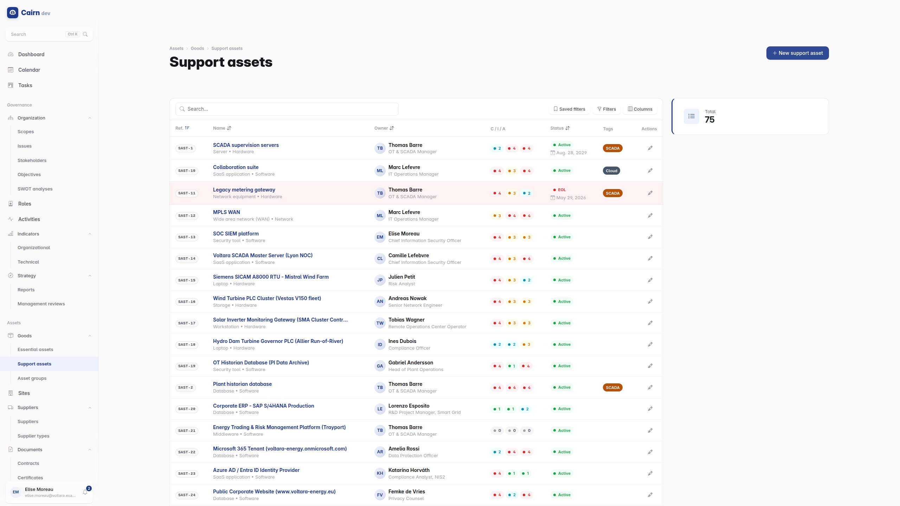
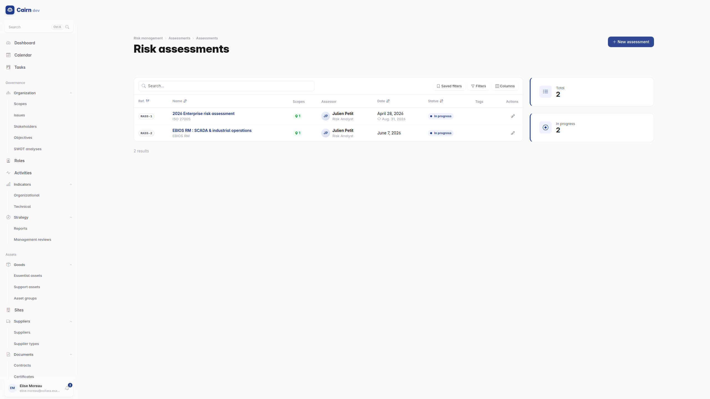
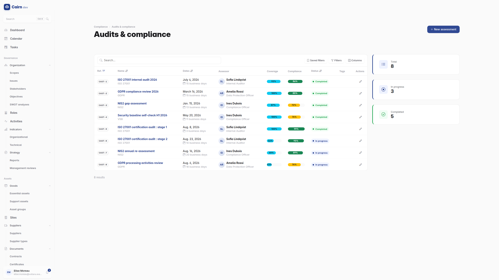
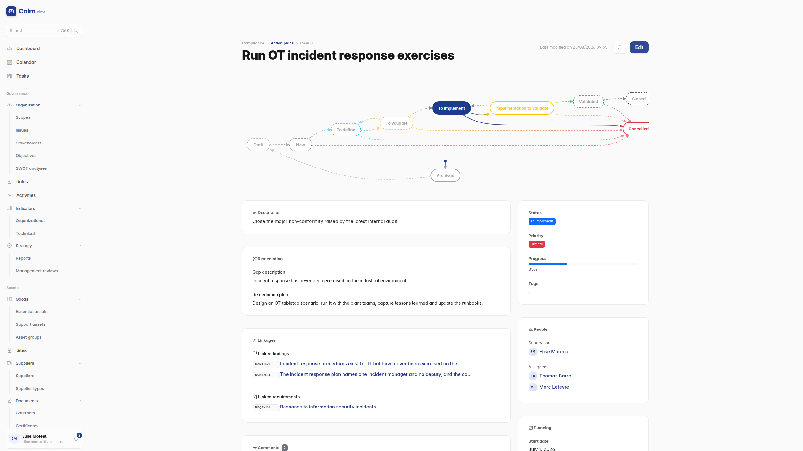
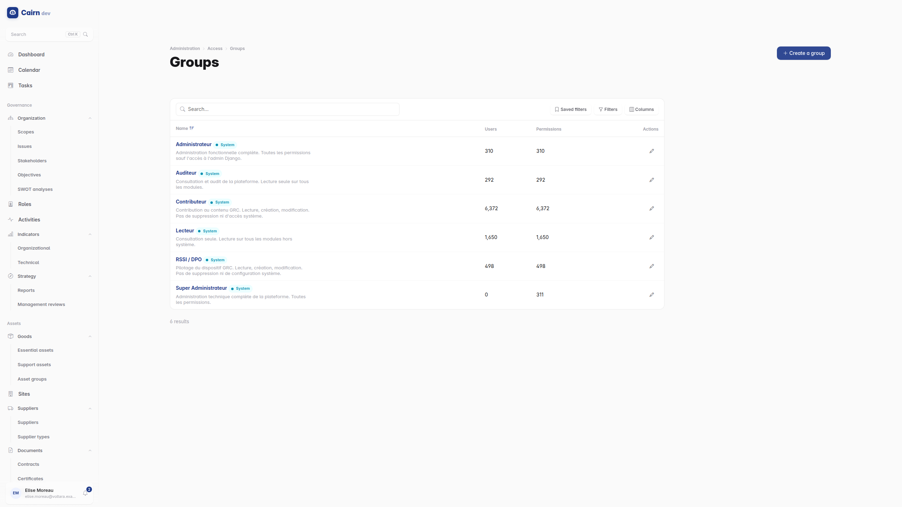
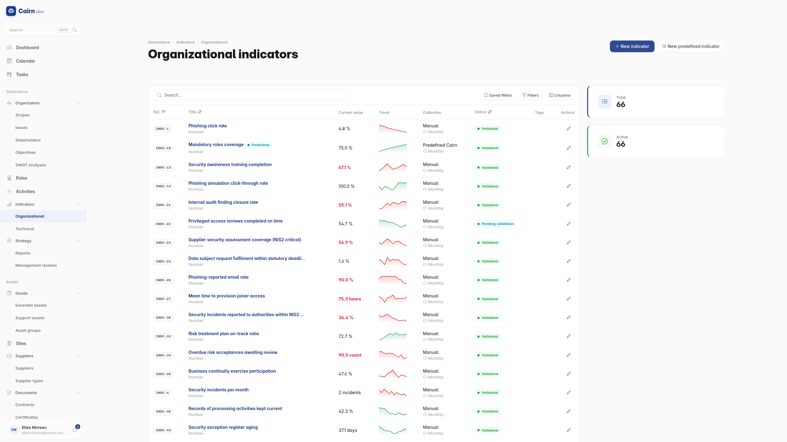
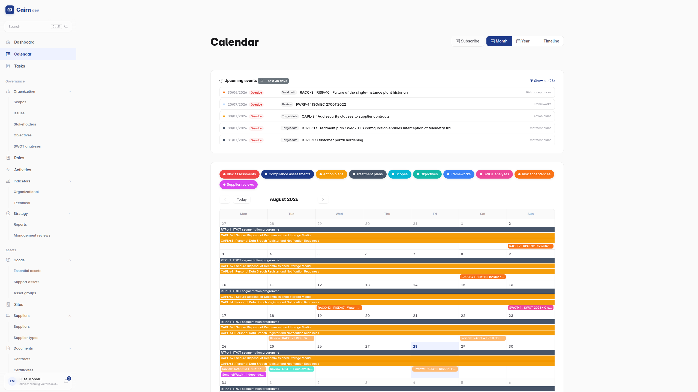

# Features

Detailed feature reference for Cairn. For module-level specifications (business rules, model fields, lifecycle), see [docs/modules/](modules/README.md).

## Governance (Context & Organisation)

| Feature | Description |
| ------- | ----------- |
| Scopes | Hierarchical organisational perimeters with versioning, approval workflow and assignable managers |
| Sites | Physical and logical locations (offices, datacenters, cloud regions) with hierarchy |
| Issues | Internal/external strategic issues (PESTLE categories) with impact and trend tracking |
| Stakeholders | Interested parties with expectations, influence/interest levels and RACI support |
| Objectives | Security and business objectives with KPI tracking (target/current values, progress %) |
| SWOT Analysis | Structured strengths/weaknesses/opportunities/threats with impact levels |
| Roles & Responsibilities | RACI matrix, mandatory role enforcement, responsibility assignments |
| Activities | Hierarchical business processes (core, support, management) with criticality levels |
| Tags | Reusable tags assignable to any domain object for cross-cutting classification |

## Asset Management

| Feature | Description |
| ------- | ----------- |
| Essential Assets | Business processes and information assets with DIC valuation (Confidentiality, Integrity, Availability on a 5-level scale) |
| Support Assets | IT infrastructure (hardware, software, network, services, sites, people) with lifecycle tracking (EOL, warranty) |
| Dependencies | Essential-to-support asset mapping with criticality, SPOF detection and redundancy tracking |
| Site Dependencies | Site-to-asset and site-to-supplier dependency tracking |
| Asset Groups | Logical grouping of support assets |
| DIC Inheritance | Support assets automatically inherit max DIC levels from linked essential assets |
| Valuations | Historical DIC evaluation tracking per essential asset |
| Suppliers | Supplier registry with types, contractual requirements, evidence reviews and dependency mapping |

## Risk Management

| Feature | Description |
| ------- | ----------- |
| Risk Assessments | ISO 27005 and EBIOS RM methodologies |
| Risk Criteria | Configurable likelihood/impact scales with dynamic risk matrix generation |
| Risks | Three-level tracking (initial, current, residual) with treatment decisions (accept, mitigate, transfer, avoid) and a frozen criteria snapshot so historical scores remain immutable when the matrix is edited |
| Threat Catalog | Reusable threats by type (deliberate, accidental, environmental) and origin, with approval workflow |
| Vulnerability Catalog | Reusable vulnerabilities with severity, CVE references, remediation guidance and approval workflow |
| ISO 27005 Analysis | Atomic threat x vulnerability risk scenarios with combined likelihood/impact calculation and approval workflow |
| EBIOS RM Foundation (ANSSI v1.5) | Workshop 0 study framework, workshop 1 security baseline with feared events (one per DIC criterion per essential asset) and baseline gaps linked to compliance requirements. Automatic bootstrap of the six workshop progress trackers on every ebios_rm assessment. Strategic vs operational iteration cycles. See [docs/modules/m4-risks/ebios-rm/](modules/m4-risks/ebios-rm/) |
| EBIOS RM Workshop 2 | ANSSI risk sources with motivation/resources/activity and auto-computed threat level V1..V4 via Grid A. Targeted objectives (lucrative, strategic, terrorist, ideological, revenge, ludic). SR/OV pairs with relevance scoring, priority score (max of threat level and relevance weight) and retention gate for workshop 3 |
| EBIOS RM Workshop 3 | Ecosystem stakeholder cartography (`(dependency × penetration) / (maturity × trust)` formula with control/monitoring/danger zoning). Strategic scenarios linking SR/OV pairs to feared events, with risk level computed via the assessment matrix and ordered attack path steps (initial access, lateral movement, exfiltration, ...). Custom REST endpoint for the ecosystem graph (nodes + edges + zones) |
| EBIOS RM Workshop 4 | Operational scenarios with ANSSI V1..V4 likelihood, gravity inherited from the parent strategic scenario, attack techniques mapped to a shared MITRE ATT&CK catalogue (seeded from a versioned fixture, refreshable via `python manage.py refresh_mitre_attack`). Custom REST endpoints for the MITRE heatmap and idempotent consolidation into the unified Risk register |
| EBIOS RM Workshop 5 | Auto-created summary per ebios_rm assessment with residual risk strategy, monitoring plan, PACS narrative, before/after cartography snapshots captured on demand. Structured PACS measures (governance, protection, defense, resilience, awareness) linked to treatment plans, baseline gaps and compliance requirements |
| Treatment Plans | Structured remediation with ordered actions, progress tracking, cost estimates and linkage to compliance action plans |
| Risk Acceptance | Formal acceptance records with expiry dates, conditions, review tracking and two-step approval workflow |
| Risk Matrices | Visual heatmaps (current vs residual) |
| Risk Treatment Flow | Sankey (cash-flow style) chart on the dashboard showing how treatment moves risks from their current level to their residual level, weighted by the number of risks per transition |

## Security Incidents

ISO/IEC 27001:2022 A.5.24 to A.5.28 and A.6.8, with the regulatory reporting duties (GDPR, NIS2, DORA) attached to the incident that raises them. See [docs/modules/m6-incidents/](modules/m6-incidents/README.md).

| Feature | Description |
| ------- | ----------- |
| Incident Response Plans | The documented A.5.24 procedure : classification scale, escalation matrix, reporting channels, evidence and lessons-learned procedures, responsible roles, applicable regulatory regimes, approval and review dates, and a last-exercise date the platform maintains itself whenever an exercise incident is closed under the plan |
| Security Events | The A.6.8 intake register : anything reported, including anonymously, assessed before it is escalated. The A.5.25 verdict is explicit (incident, weakness, duplicate, false positive, no action required) and a blank verdict means the assessment has not concluded, rather than "nothing found" |
| Promotion | An assessed event becomes an incident or a catalogue vulnerability in one atomic, permissioned act : the target is created, declared through its own lifecycle, linked back to the event, and the event moves to its confirmed step, all in a single transaction with a mandatory rationale |
| Incidents | Detected -> Triaged -> Investigating -> Contained -> Eradicated -> Recovered -> Post-incident review -> Closed, with reopen paths and an honest "reclassified as an event" off-ramp that is refused once a regulator has been notified. Each phase stamps its own write-once clock, so time-to-contain and time-to-recover are derived, never typed |
| Impact & Blast Radius | CIA impact flags, severity with the triage-time severity kept alongside it, TLP handling caveat, outage duration and estimated cost, plus links to affected essential and support assets, sites, activities, suppliers, threats, exploited vulnerabilities, realised risks and compliance requirements |
| Legal Awareness Anchor | `awareness_at` is separate from technical detection : it is what every statutory clock counts from, it can never precede detection, and an awareness that postdates detection must be justified in writing before triage completes |
| Exercises | An incident flagged as an exercise raises no notification obligation at all and, on closure, records itself as the plan-testing evidence on its response plan |
| Chronology | An append-only incident timeline (observation, action, decision, communication, escalation, evidence, external input, correction). Every lifecycle transition appends its own entry, so the narrative and the state machine cannot diverge. Nothing is edited or deleted : a mistake is corrected by a further entry naming the one it supersedes |
| Response Actions | Containment, eradication, recovery, evidence collection, communication, escalation and workaround steps with owner, performer, due date, outcome and effectiveness. A plain status column on purpose : a containment step lives for minutes and does not need an approval workflow |
| Evidence Register | A.5.28 forensic artefacts with acquisition method, source asset, storage location, size, content hash and algorithm, TLP, legal hold, retention date and admissibility notes. Large artefacts are *registered by reference* : the platform holds the fingerprint of something it does not store, rather than silently holding nothing |
| Evidence Lifecycle | Draft registration -> Collected -> Secured (sealed) -> Analysed -> Retained -> Released or Destroyed. Sealing is a state, not a checkbox; destruction and release are permissioned transitions with a mandatory comment, never a `DELETE`; and only a draft registration - a typo - can be deleted at all |
| Chain of Custody | An append-only ledger of every handling act (collected, sealed, transferred, accessed, copied, analysed, integrity verified, released, returned, destroyed), each with actor, time, location, named counterparty where a handover requires one, and the hash measured at that moment. Rows are never edited and never deleted |
| Integrity Verification | Re-measures the stored artefact and appends the result to the custody ledger. The verdict is three-way and never collapsed : `match`, `mismatch` (a permanent claim about the artefact) and `not_verifiable` (a claim about the storage) |
| Reporting Authorities | A catalogue of the bodies filings go to (supervisory authorities, CSIRTs, competent and sector regulators, law enforcement) with jurisdiction, portal URL, contacts, notification language and procedure |
| Obligation Templates | The rules that decide what a given incident owes : regime, recipient kind, legal reference, content requirements, the clock anchor and delay in hours (or an explicit "no fixed deadline"), the previous stage a staged filing depends on, and the applicability conditions (minimum severity, significance, personal data, high risk, cross-border, controller role, category, jurisdiction) |
| Notification Obligations | Generated at triage from the matching templates, the response plan's regimes and the GDPR flags, then regenerated idempotently whenever the answer can change. Each obligation carries its own snapshot of the terms, its anchor, its deadline and the recipient it is owed to, across GDPR Art. 33(1) / 33(2) / 34, NIS2 early warning / notification / intermediate / final, DORA initial / intermediate / final, ePrivacy, CRA, sector, law enforcement, CSIRT, contractual, insurer, internal and public regimes |
| Legal Clocks | Deadlines are derived, never stored as a status : the 72-hour and 24-hour clocks run wall-clock through nights and weekends, a staged filing's clock starts from the previous stage's actual submission, and a filed obligation freezes its anchor so the record stops moving. "Overdue", "no statutory deadline" and "deadline not yet started" are three distinct answers |
| Deciding Not to Notify | An omission is a judgement, and the platform records it as one : a named decider, a timestamp, a written rationale and an approval permission, reached through the obligation's own transition. An undecided obligation stays visible, and no incident closes while one is still undecided |
| Filings | An append-only log of what was actually transmitted : channel, recipient, subject, verbatim content, external reference, the recipient's outcome, and an attached proof document served only through a permission-checked download. A correction is a new filing superseding an earlier one, never a rewrite, and the first filing freezes the lateness verdict |
| Personal Data Breach | The GDPR qualification of one incident : controller / joint controller / processor capacity, data and data-subject categories, volumes, special categories, likely consequences, measures taken, the Art. 34(1) high-risk determination as a genuine three-state verdict, the Art. 34(3) exemption relied on, DPO contact and the Art. 33(5) register entry. Ruling a breach out is a transition with a rationale, never the clearing of a checkbox |
| Post-Incident Reviews | A.5.27, exactly one per incident : root cause with the method used to find it (five whys, Ishikawa, fault tree, timeline reconstruction, barrier analysis), contributing factors, detection gap, containment assessment, what went well and what failed, recurrence likelihood, and an effectiveness verification date and verdict per ISO 27001 clause 10.2 |
| Feeding the ISMS Back | A review links out to the registers that already exist rather than duplicating them : nonconformities land in the organisation-wide `Finding` register stamped as incident-born, plus corrective action plans, failed controls, controls to strengthen, risks to reassess, vulnerabilities to register and ISMS changes. The approved effectiveness verdict is propagated onto the nonconformities the review raised |
| Closure Gates | An incident closes only on an approved post-incident review, a decision recorded on every notification obligation, and no evidence item left merely collected. A triage that produced no obligation at all must state in writing why nothing is owed |
| Six Lifecycles | Incident, security event, evidence, notification obligation, post-incident review and personal data breach each run their own registered lifecycle, driving report inclusion, linking and deletion, with per-transition permissions and mandatory comments on every judgement |
| Steering Integration | A **Notification deadlines** dashboard widget (late first, then the tightest clock), notification deadlines, post-incident review and effectiveness dates and evidence retention dates on the calendar, incidents on the Tasks board dated by the nearest deadline still owed, and incidents and security events in global search and the command palette |
| Permissions | Six features - `incidents.incident`, `.event`, `.response_plan`, `.evidence`, `.notification`, `.review` - with child entities gated by their parent's feature, and scope tenancy inherited from the incident by every child, grandchild included |

## Compliance

| Feature | Description |
| ------- | ----------- |
| Frameworks | Regulatory and standard frameworks (ISO 27001, GDPR, NIS2, etc.) with type, category and jurisdiction |
| Sections | Hierarchical framework structure |
| Requirements | Per-framework requirements with compliance status, evidence and gap tracking |
| Assessments | Compliance evaluations with per-requirement results and automatic compliance level calculation |
| Findings | Audit findings (major/minor non-conformities, observations, opportunities, strengths) linked to assessments |
| Action Plans | Gap remediation plans with priority, progress, cost tracking and threaded comments |
| Inter-Framework Mappings | Requirement-to-requirement mappings across frameworks (equivalent, partial, includes, related) |
| Framework Import | Excel-based bulk import of frameworks and requirements |

## Users & Access Control

| Feature | Description |
| ------- | ----------- |
| Custom User Model | Email-based authentication with UUID primary keys |
| Role-Based Access Control | Granular permissions (90+) using `module.feature.action` codenames |
| 6 System Groups | Super Admin, Admin, RSSI/DPO, Auditor, Contributor, Reader |
| Scope-Based Tenancy | Groups can be restricted to specific organisational scopes; scope managers automatically gain access |
| Account Security | Failed login lockout (5 attempts / 15 min), password complexity enforcement |
| Dual Authentication | Session-based (web UI) + JWT with token rotation (API) |
| Passkey Authentication | FIDO2 WebAuthn passwordless login with discoverable credentials |
| Access Logs | Full audit trail of authentication events (login, logout, lockout, password change) |

## Indicators (KPI Tracking)

| Feature | Description |
| ------- | ----------- |
| Custom Indicators | Manual KPI, metric and compliance metric tracking with number, boolean or percentage formats |
| Predefined Indicators | Auto-computed metrics (global compliance rate, risk treatment rate, objective progress, etc.) |
| Thresholds | Critical threshold detection with configurable operators and min/max bounds |
| Measurement History | Timestamped measurements with trend and delta tracking |
| Sparklines | Inline charts on the dashboard for numeric indicators |

## Platform Capabilities

| Feature | Description |
| ------- | ----------- |
| Real-Time Dashboard | WebSocket-powered live statistics via Django Channels with animated counters and auto-reconnect |
| Calendar & iCal | Unified calendar view across all modules with iCal subscription feed and per-user tokens |
| Global Search | Multi-category search across all domain objects |
| Ask Cairn (optional) | Natural-language questions in the command palette, answered by a pluggable LLM provider (Mistral AI by default; OpenAI / any OpenAI-compatible endpoint; Claude; self-hosted Ollama) routing to read-only data tools with the caller's permissions; answers cite real records under an AI-labeled summary. Off by default. See [docs/modules/assistant/](modules/assistant/README.md) |
| Reports | Configurable report generation (SoA PDF, Audit report PDF, Management review PPTX/DOCX) with status tracking |
| Management reviews | Persistent ISO 27001:2022 clause 9.3 workflow with life cycle, decisions, ISMS changes, participants, snapshot-based auditability, and retrochaining to action plans, treatment plans, and objectives |
| Stakeholder feedback | Formal feedback channel (clause 9.3.2.e) with sentiment, severity, and traceability to issues and expectations |
| Lifecycle Workflows | Unified lifecycle on every domain model (Draft / Pending validation / Validated / Archived by default, plus 29 entity-specific workflows), driving report inclusion, linking, deletion and notifications, with a generic stepper UI, per-transition permissions and mandatory comments on refusals / cancellations |
| Notifications | In-app + email notifications on lifecycle events (element submitted for validation), with a live bell badge (WebSocket), recipient fallback chain (scope managers, approvers, creator) and per-user email opt-out |
| Audit Trail | Full change history on every model via django-simple-history |
| Versioning | Automatic version increment on all domain objects |
| Company Settings | Centralised platform configuration (organisation name, logo, defaults); the company name and logo head the dashboard |
| Bilingual UI | Full French/English interface with contextual help banners |
| Excel Export | Export assets, risks, compliance data to Excel |
| Display Theme | Per-user Light / Dark / System preference (System follows the OS), persisted server-side and exposed through the API |
| Responsive UI | Collapsible sidebar, mobile-friendly layout |
| REST API | Full CRUD + filtering, search, pagination, batch creation and export on all resources - see [api.md](api.md) |
| HTMX Integration | Dynamic partial updates without full page reloads |
| MCP Server | JSON-RPC 2.0 server with 50+ tools and OAuth 2.0 authentication for external clients - see [mcp-server.md](mcp-server.md) |
