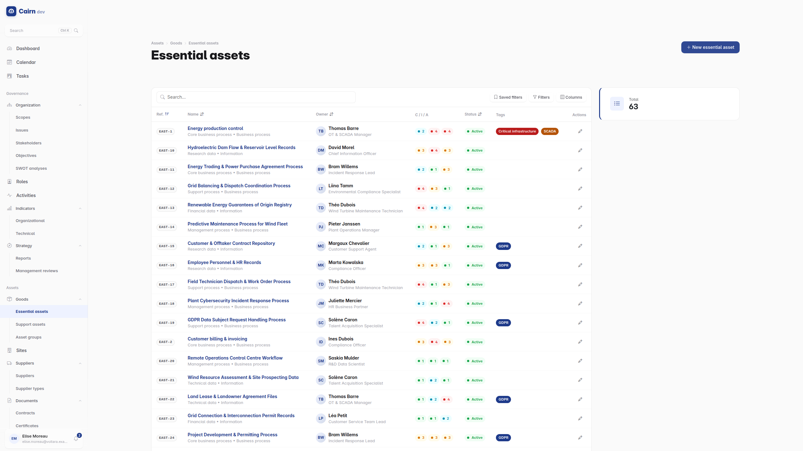
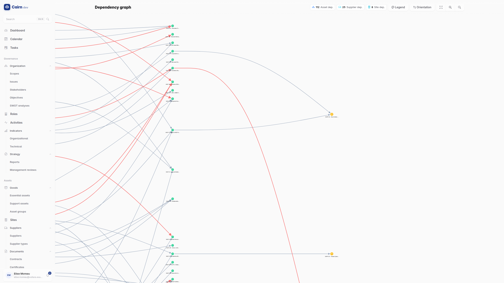
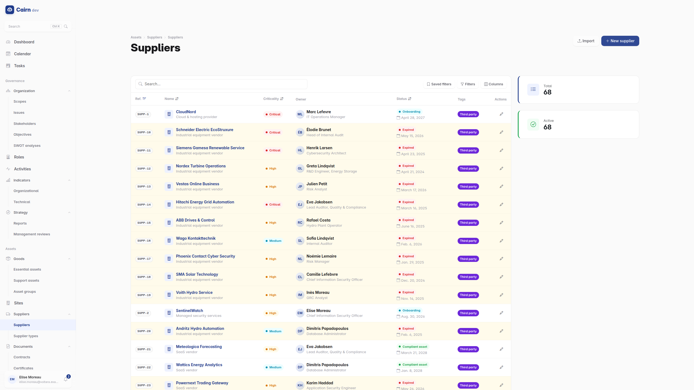
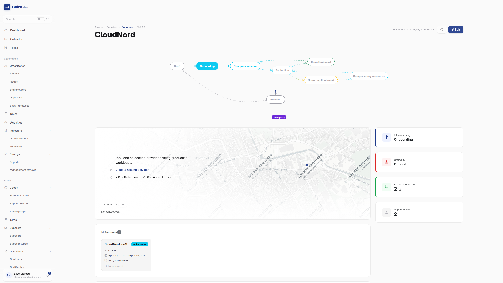

# Assets and suppliers


## The two kinds of asset



Cairn separates what the business depends on from what carries it, and the
separation is the point rather than a taxonomy exercise.

**Essential assets** are business processes and information : the payroll
process, the customer database, the SCADA telemetry. They are what a risk is
ultimately about. Each is valued on three criteria, **confidentiality,
integrity and availability**, on a five-level scale. That valuation is a
business judgement and it is where the whole model gets its weighting.

**Support assets** are the IT infrastructure that carries them : servers,
applications, network equipment, services, sites, people. They have a lifecycle
of their own : end of life, end of support, warranty expiry.

## Dependencies, and why they earn their keep

A dependency links an essential asset to the support assets it relies on, with a
criticality and a redundancy indication. There are four kinds : asset to asset,
asset to supplier, site to asset, site to supplier.

Two things fall out of the graph, and they are the reason to build it.

**CIA inheritance.** A support asset automatically inherits the highest CIA
levels of the essential assets that depend on it. You value the business
process once, and the criticality of the server underneath it is derived rather
than argued about.

**SPOF detection.** Cairn continuously identifies single points of failure :
where one support asset or one supplier carries something critical with no
redundancy. The count is on the dashboard, and the detail names the dependency.
A SPOF you have accepted is a decision; a SPOF you did not know about is an
outage waiting for a Tuesday.



The **dependency graph** renders all of it visually, which is usually how
somebody first notices that three critical processes rest on one virtualisation
host.

## Asset groups

Logical groupings of support assets, for when the same treatment applies to a
set rather than to individuals.

## Sites

Physical and logical locations : offices, datacenters, cloud regions, and they
are hierarchical. A site runs an operational lifecycle rather than the default
one:

```
Draft ──▶ Commissioning ──▶ Operational ──▶ Review
                                              │
                            Decommissioned ◀──┘
```

Sites participate in dependencies, so "which processes stop if this datacenter
does" is a question the graph answers.

## Suppliers



The third-party register, and the part of the module most often driven by a
regulator rather than by choice.

A supplier carries its contacts, its mapped addresses, its subsidiaries, and its
**sub-processors** : the parties your supplier in turn relies on. That last one
is what supply-chain mapping under NIS2 and DORA actually requires, and it is
why the field exists rather than a free-text note.



**Supplier types** carry requirements, and a supplier is evaluated
**per requirement** with an evidence review rather than given a single overall
score. "Compliant" as a single verdict is not defensible; "compliant on twelve
of fourteen requirements, with these two under remediation" is.

Suppliers can be **bulk imported from CSV**, which matters when the register
starts as a spreadsheet somebody has been maintaining for three years.

## Documents

**Contracts** are multi-party : suppliers on one side, customer stakeholders on
the other. They carry amendments, supersession (which contract replaced which),
an attached PDF stored securely rather than on a share, and a lifecycle of
Draft, Active, then Expired or Terminated.

**Certificates** are your own : the ISO 27001, HDS or SOC 2 certificates your
organisation holds. Each is attached to the framework it attests, with the
certification body, validity dates, the sites it covers, its renewal history and
the PDF.

Certificates are what the [Trust Center](trust-center.md) publishes, so keeping
them current here is what keeps the public page honest.

## A workable order

1. **Activities** first, in [organisational context](organisational-context.md).
2. **Essential assets**, attached to those activities, valued on CIA.
3. **Support assets**, the infrastructure.
4. **Dependencies** between them. This is the step people skip, and it is the
   one that makes CIA inheritance and SPOF detection work.
5. **Suppliers**, with their types and requirements.
6. **Contracts and certificates**, attached to the suppliers and frameworks that
   already exist.
