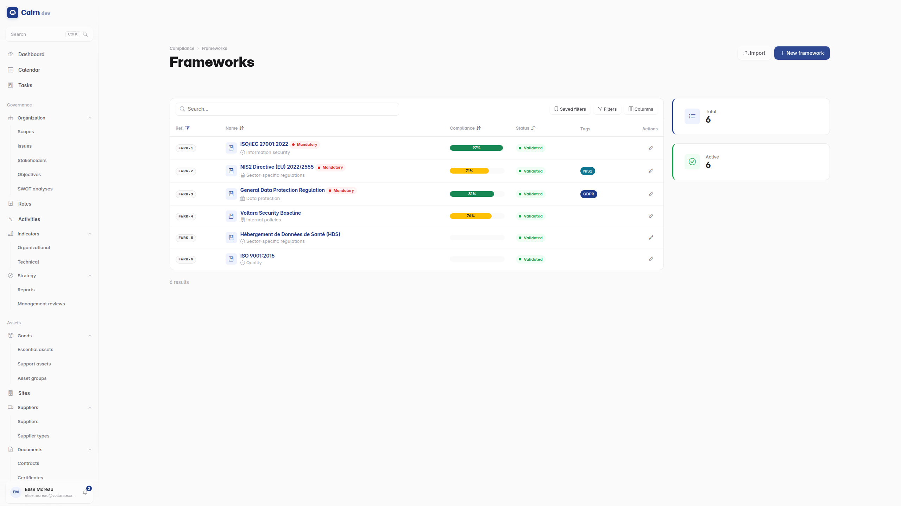
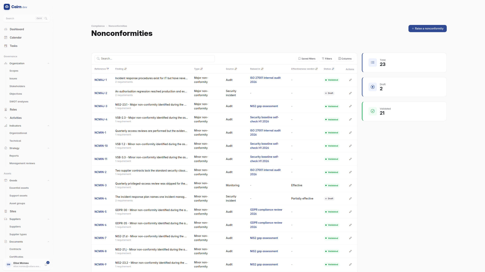
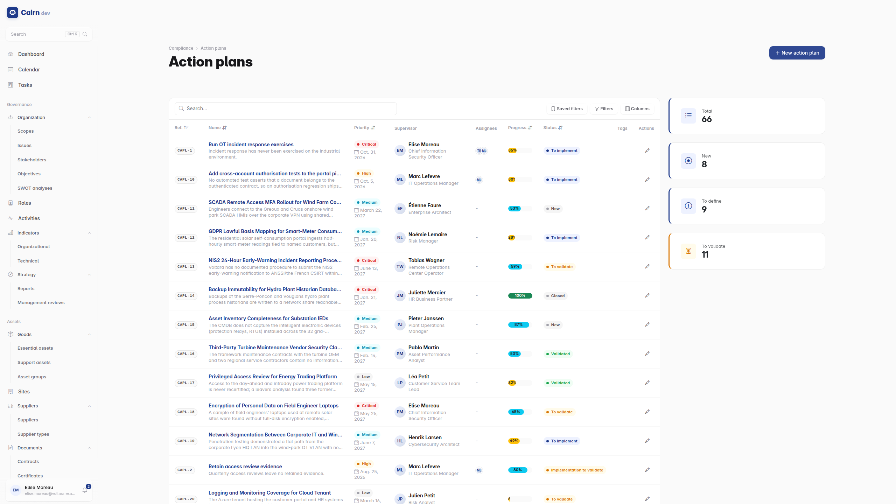

# Compliance

## Frameworks and requirements

A **framework** is a standard or regulation you measure yourself against : ISO
27001, GDPR, NIS2, DORA, or your own internal policy set. It contains
**sections**, which contain **requirements**.

Frameworks can be **imported from Excel**, which is how most organisations get
started : the control set already exists in a spreadsheet, and retyping it is
both slow and error-prone.

Each requirement carries a compliance status from an eleven-value scale, richer
than compliant / non-compliant because an audit finding is not binary :
not assessed, evaluated, non-compliant, partially compliant, major
nonconformity, minor nonconformity, observation, improvement opportunity,
compliant, strength, not applicable.

The audit statuses map onto the conformance averages, so a major nonconformity
weighs differently from an observation in the percentage you see on the
dashboard.

## Applicability

A requirement is either applicable to your scope or not, and the justification
for "not applicable" is what an auditor reads first.

A framework can also be switched to **risk-driven applicability**, where each
requirement's applicability is derived automatically from the risks linked to
it. In that mode the field becomes read-only and follows the risk register : a
control is applicable because a risk requires it, rather than because someone
ticked a box. It is the more defensible model, and it only works if the risk
register is actually maintained.

## Assessments

An assessment is an audit : an assessor, a period, one or more frameworks in
scope, and a status of its own. It is where requirements get evaluated and
findings get raised.

The assessment detail page is one of the few in Cairn that uses tabs, because
Planning, Findings and History are genuinely distinct modes of working rather
than sections of one page.

While an assessment is running, the **Ongoing audits** widget appears on the
dashboard. It disappears when none is.

## Nonconformities

The organisation-wide nonconformity register, ISO 27001 clause 10.1 and 10.2.
**One register**, fed from five sources : audits, incidents, management reviews,
monitoring and complaints.

That single register is the design decision worth noticing. Nonconformities
raised during an audit and nonconformities raised by a post-incident review are
the same kind of object with the same lifecycle, and keeping them in one place
is what lets you answer "what is open against us" in one screen rather than
three.

Each nonconformity carries its corrective action and, crucially, an
**effectiveness verdict** : did the correction actually work. A corrective
action with no verification is a closed ticket, not a closed nonconformity.

## Action plans

The remediation backlog, and one plan in detail:

The remediation work, linked to the requirements it addresses. An action plan
has an owner, a priority, a target date, a gap description and a remediation
plan.

It runs a longer lifecycle than most records, because remediation has real
stages : new, to define, to validate, to implement, implementation to validate,
validated. Two of those steps are validations by design, one on the plan and one
on the delivery, so "we agreed the plan" and "we agree it was done" are separate
recorded decisions.

Any of those steps can also be cancelled, and every transition backwards is a
refusal with a recorded reason.

Action plans appear on the [tasks board](finding-your-way.md#the-tasks-board)
alongside risk treatment actions, so the remediation backlog is visible in one
place regardless of which module raised it.

## Mappings

Inter-framework mappings : this ISO 27001 control satisfies that NIS2 article.

The payoff is compounding. Once ISO 27001 is assessed and mapped to NIS2, the
NIS2 picture is largely derived rather than re-audited. For an organisation
subject to three overlapping regimes, this is the difference between three
audits and one plus two reconciliations.

## A workable order

1. **Import or create the framework.**
2. **Review applicability**, and justify every exclusion.
3. **Run an assessment**, evaluating requirements and raising findings.
4. **Raise action plans** for the gaps, with owners and target dates.
5. **Map** to your other frameworks, once the first is meaningfully complete.
6. **Generate the Statement of Applicability** from
   [reports](reports.md).
