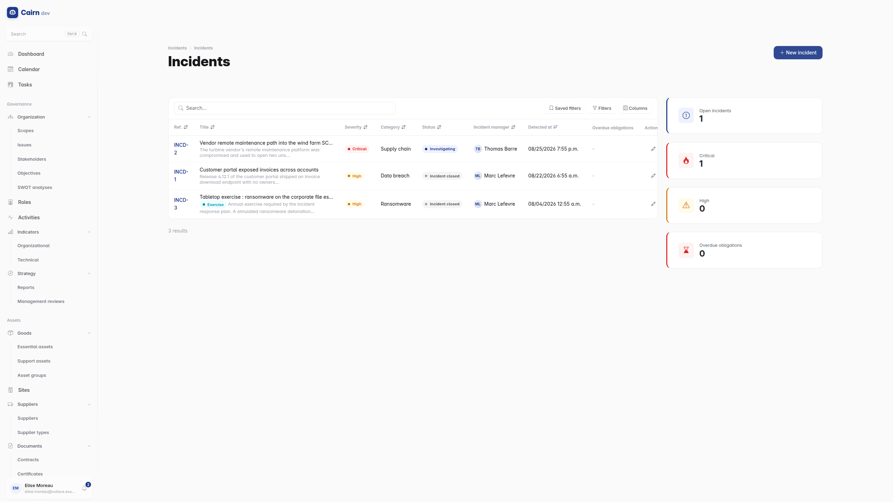
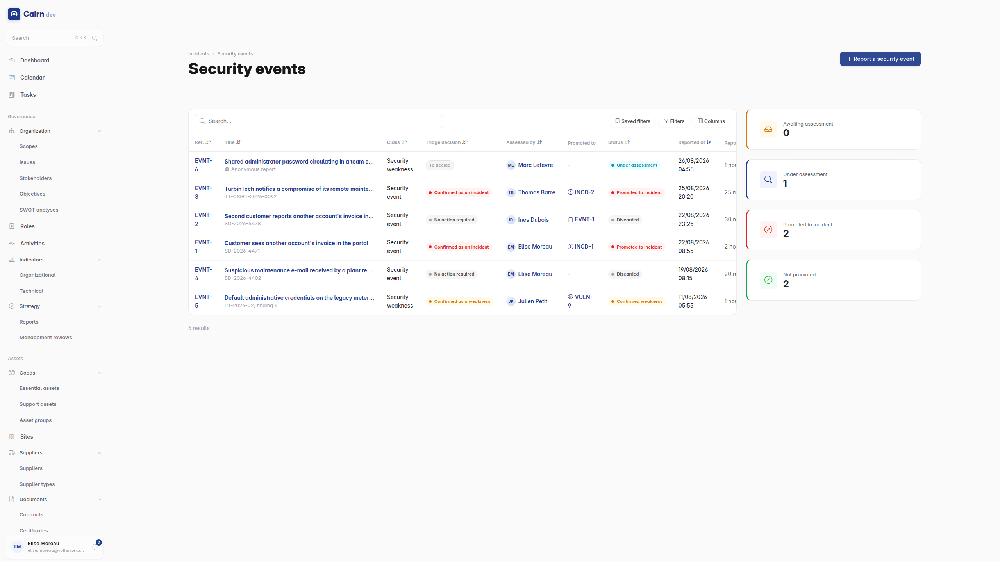
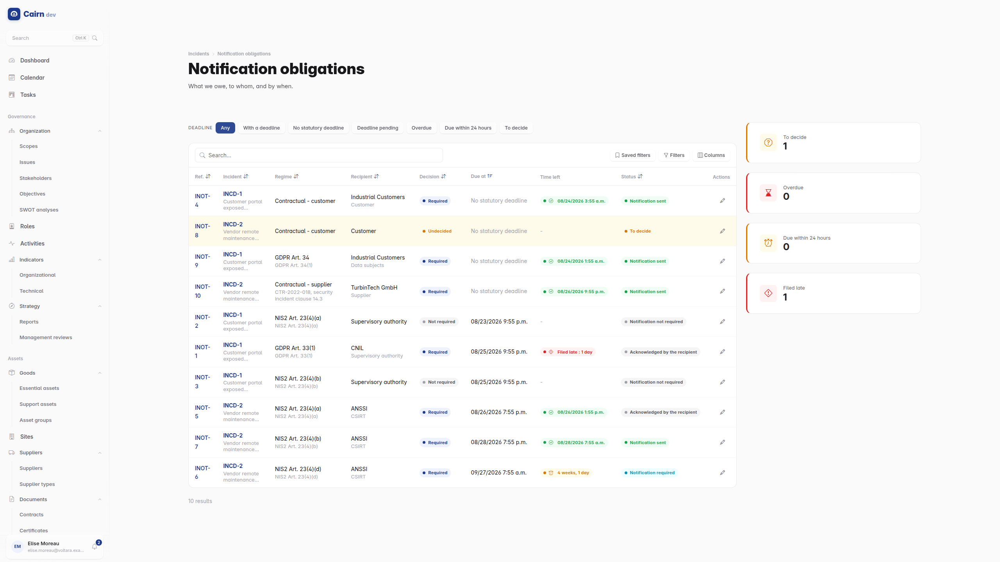

# Incidents

ISO/IEC 27001:2022 A.5.24 to A.5.28 and A.6.8, with the statutory reporting
duties attached to the incident that raises them.

The module is built on one idea : **an incident record is evidence**. Its
chronology, its artefacts and its notification decisions may end up in front of
a regulator, so the design refuses shortcuts that would make any of them
deniable.



## Events come before incidents

Not everything reported is an incident, and treating it as one inflates your
numbers and your workload.



A **security event** (A.6.8) is the intake. Anyone can raise one. It is assessed
*before* anything escalates : a false positive stays an event and is closed as
one. A confirmed event is **promoted**, in a single recorded act, into either an
incident or a vulnerability.

Promotion is a transition, not a copy-paste. It creates the target, declares it,
moves the event on, and checks both the event's transition permission and the
create permission of the register receiving it. The link between the event and
what it became is preserved.

## The incident lifecycle

```
Detected ──▶ Triaged ──▶ Investigating ──▶ Contained ──▶ Eradicated
                                                              │
        Closed ◀── Post-incident review ◀── Recovered ◀───────┘
```

Each transition **writes its own entry in the incident's chronology**. The
timeline is a by-product of handling the incident, not a form somebody has to
remember to fill in afterwards, which is precisely when memory is worst.

The chronology is **append-only**. There is no edit and no delete. A mistake is
corrected by appending an entry of type `correction` that names the entry it
supersedes. That is how a timeline stays credible : the correction is visible,
not invisible.

## Response plans and actions

**Response plans** are the playbooks, prepared in advance. **Response actions**
are what was actually done during this incident, with an owner and a status.

## Evidence and chain of custody

The evidence register (A.5.28) is the part with the strictest rules, because
this is what has to survive a challenge.

An artefact is **hashed on acquisition**. Evidence is **sealed as a lifecycle
state**, not as a checkbox somebody can untick. Its integrity can be
**re-measured on demand**, returning one of three verdicts : `match`,
`mismatch`, or `not_verifiable`. The third exists because "we cannot check" is
an honest answer and pretending otherwise is not.

Handling is recorded in an **append-only chain of custody**. Release and
destruction are permissioned transitions, never a delete. Nothing removes a row
from the custody ledger.

Artefacts never appear in an API payload and are never at a guessable URL. They
stream through a permission-checked download, so evidence carrying a TLP caveat
is not one URL guess away from anyone.

## Statutory notifications



This is the module's most demanding surface, and the one that pays for itself
the first time a clock is running.

At triage, Cairn generates the **notification obligations** that apply, from a
catalogue of **reporting authorities** and **obligation templates** : GDPR
Article 33 and 34, NIS2, DORA, ePrivacy, CRA, sector-specific and contractual.

Each obligation runs **its own legal clock** from the incident's awareness
anchor. GDPR's 72 hours and NIS2's 24-hour early warning are different clocks on
the same incident, and Cairn tracks them as such rather than picking one. Due
dates and overdue status are computed, never typed, so they cannot be quietly
adjusted.

An obligation is discharged through an **append-only filing log** that keeps the
proof of what was actually transmitted, with the recipient's acknowledgement and
external reference recorded when they come back. Filing again supersedes an
earlier filing rather than overwriting it.

**Deciding not to notify is itself a decision.** It is named, timestamped,
approved, and carries a written rationale. It is never a blank row. When a
regulator later asks why they were not told, the answer exists, with a date and
an author, instead of being reconstructed.

The **Notification deadlines** dashboard widget shows the clocks that are late or
still running, together with the incidents still open behind them.

## Personal data breaches

Where personal data is involved, a GDPR qualification record is opened : the
Article 33(5) record, with its own confirm or rule-out verdict. Ruling out a
breach is a recorded decision with a reason, on the same principle as deciding
not to notify.

## Post-incident review

The A.5.27 review, and the place where an incident stops being an incident and
becomes an improvement.

A review feeds three registers : the [nonconformity register](compliance.md),
the [risk register](risks.md), and the ISMS change log. Its corrective actions
get an **effectiveness verification**, so "we fixed it" is a claim someone
checked rather than a claim someone made.

## Configuration

Under Incidents -> Configuration:

**Reporting authorities** are the bodies you may have to notify : your data
protection authority, your NIS2 competent authority, your financial regulator,
with their contact routes.

**Obligation templates** encode the rule : which regime, which trigger, which
deadline, measured from what. Getting these right once is what makes triage
generate the correct obligations every time afterwards.

Both are shared catalogues, deliberately not filtered by scope : a reporting
authority is reference data, not a record about your organisation.
