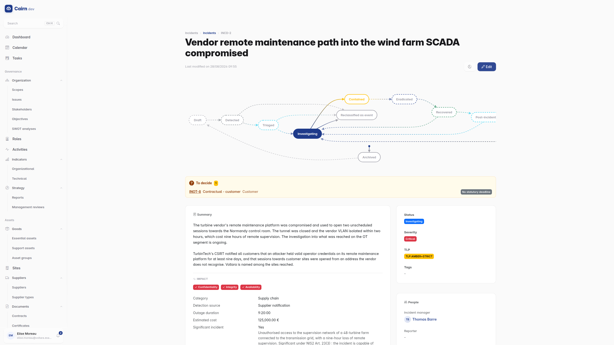

# How records move

Every record in Cairn, a risk, a scope, an incident, an action plan, sits on a
**step** in a lifecycle. The step is not a label. It decides three things that
matter far beyond the record itself.

| The step decides | Which means |
| --- | --- |
| Whether the record **counts in reports** | A draft risk does not inflate your risk count, and does not appear in the Statement of Applicability |
| Whether other records can **link to it** | A draft framework cannot be attached to an audit, because it is not settled yet |
| Whether it can be **deleted** | Once a record has been validated, deletion is no longer offered. It is archived instead |

This is why a number on the dashboard and a number in a list can legitimately
differ : one counts what is in force, the other shows what exists.

## The stepper

Every detail page carries the same control, at the top, showing where the record
has been, where it is, and where it can go.

It comes in two shapes, and which one you see depends on the record's lifecycle
rather than on the page. A **linear** lifecycle, such as the default one, draws
a connected row of pills. A **graph** lifecycle, such as an incident's, draws
the steps as a network, because the route is genuinely not a line : an incident
under investigation can be contained, reclassified as an event, or archived, and
a row of pills would misrepresent that as an order.



In both shapes the same rules apply.

- **Done steps** are behind you.
- **The current step** is highlighted.
- **The next step** is a button, and it is only offered if you have the
  permission for it. If you cannot see the button someone else can, that is the
  gate working.
- **Future steps** are shown greyed, so you can see the road ahead.
- **Earlier pills are clickable**, which is how you send something back. That is
  refusal and rework : an action plan submitted too early goes back to drafting,
  and the round trip is recorded.
- **Archiving** is the off-ramp, available from anywhere.

Some transitions **require a comment**, and Cairn will not let you proceed
without one. Those are the moments where the reason matters as much as the
decision : a refusal, an archive, a decision not to notify an authority.

The stepper is the only way a state changes. There is no status dropdown, and
the API has no field you can patch to move a record. That is deliberate : the
transition is where the permission check, the mandatory comment and the recorded
event live, and a shortcut around it would be a hole in the audit trail.

## The default lifecycle

Most records run a four-step lifecycle.

```
Draft ──▶ Pending validation ──▶ Validated ──▶ Archived
  ▲                                               │
  └───────────────── restore ─────────────────────┘
```

**Draft** is where you work. Only here can a record be deleted. **Pending
validation** is submitted and waiting. **Validated** counts in reports and can
be linked to. **Archived** is the exit : the record leaves the operational view
without being destroyed, and can be restored to draft.

## Lifecycles that are not the default

Where the business has real operational stages, the lifecycle reflects them
rather than flattening them into "approved / not approved".

**A scope** runs Draft, Definition, Validation, In force, Review. Review loops
back to In force, because a perimeter is re-examined periodically rather than
re-created.

**A site** runs Draft, Commissioning, Operational, Review, with Decommissioned
and Archived as exits.

**An incident** runs Detected, Triaged, Investigating, Contained, Eradicated,
Recovered, Post-incident review, Closed. Each transition writes its own entry in
the incident's chronology, so the timeline is a by-product of handling the
incident rather than something someone has to remember to fill in.

**A contract** runs Draft, Active, then Expired or Terminated.

The complete set, with every step and transition, is in the
[lifecycle reference](../reference/generated/lifecycles.md).

## Who can move a record

A transition can be gated three ways, and often is:

- **By permission.** The `approve` action on the relevant feature.
- **By role.** Restricted to whoever holds a given ISO 27001 role, for that
  record's perimeter. The person who wrote it is often not the person who
  validates it, and that separation is the point.
- **By person.** Some transitions are reserved for the record's own owner.

If a transition is not offered to you, one of these is why.

## Archiving is not deleting

This is the distinction to internalise.

**Archiving** removes a record from the operational view. It stops counting in
reports, stops being linkable, and keeps its entire history. It can be restored.

**Deleting** is only possible from a step marked deletable, in practice from
draft, before the record has meant anything to anyone. Once something has been
validated, deletion stops being offered.

If you find yourself wanting to delete a validated record, what you want is to
archive it. The audit trail is the reason : a compliance platform where
inconvenient records can disappear is a compliance platform nobody can rely on.

## Administrators can change the lifecycles

Under Administration -> Lifecycles, an administrator can edit the steps and
transitions of any lifecycle : rename a step, add one, change what requires a
comment, change which permission gates a transition.

This is powerful and it is not cosmetic. Adding a step changes what "validated"
means for every existing record of that type. Change lifecycles deliberately,
and preferably not in the middle of an audit.
