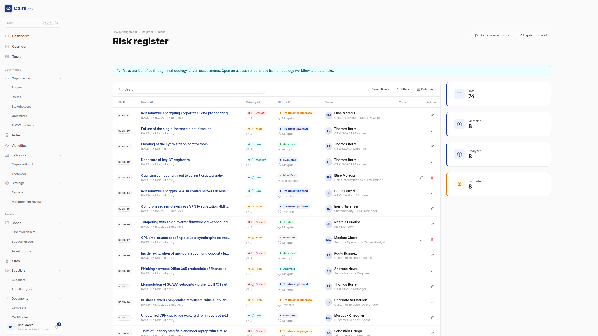
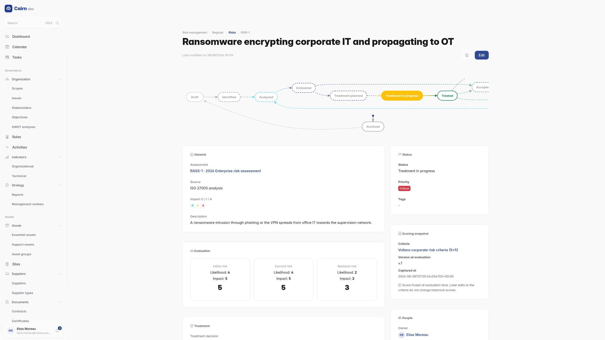

# Risks

Cairn supports two methodologies. **ISO 27005** is the classic
threat x vulnerability approach. **EBIOS RM** is the ANSSI method (version 1.5),
run as five workshops. Both feed the same unified risk register, so an
organisation can use one, the other, or both without ending up with two
disconnected registers.

## Criteria first

Risk criteria define the scales : the likelihood levels, the impact levels, and
the matrix that turns a pair of them into a risk level. Create them before your
first assessment, because they are what scores mean.

Editing criteria later does **not** rewrite scores already given. Each risk
keeps a frozen snapshot of the criteria it was scored under, so historical
scores stay meaningful and a matrix change does not silently rewrite last year's
audit. This is the right behaviour and it does mean two risks scored under
different criteria are not directly comparable.

## The register

A risk is tracked at **three levels** :

| Level | Meaning |
| --- | --- |
| **Initial** | Before any control |
| **Current** | With the controls actually in place today |
| **Residual** | After the planned treatment |

Each has its own likelihood and impact. The gap between current and residual is
the value your treatment plan claims to deliver, and the
[risk treatment flow](dashboard.md) widget on the dashboard visualises exactly
that movement.

A treatment decision is one of four : **accept**, **mitigate**, **transfer**,
**avoid**.

## Catalogs

**Threats** are reusable, classified by type (deliberate, accidental,
environmental) and origin. **Vulnerabilities** are reusable too, with severity,
CVE references and remediation guidance.

Both run an approval lifecycle, so a catalog does not fill up with duplicates
somebody added in a hurry. A draft threat cannot be linked into an analysis
until it is validated.

## ISO 27005 analyses

An ISO 27005 analysis is an atomic scenario : one threat exploiting one
vulnerability against one asset. Likelihood and impact combine into a level
through the assessment's matrix.

Keeping scenarios atomic is what makes them re-usable and comparable. "Ransomware
affects the company" is not a scenario; "phishing (threat) exploits the absence
of MFA (vulnerability) against the payroll process (essential asset)" is.

## EBIOS RM

The five workshops, in order, each building on the last.

**Workshop 0 and 1, framing and the security baseline.** The study framework,
then the security baseline with **feared events** : one per CIA criterion per
essential asset, so the possibilities are enumerated rather than brainstormed.
**Baseline gaps** link to compliance requirements, which is where the risk and
compliance modules meet.

**Workshop 2, risk origins.** ANSSI **risk sources** with their motivation,
resources and activity, from which a threat level V1 to V4 is computed via Grid
A. **Targeted objectives** (lucrative, strategic, terrorist, ideological,
revenge, ludic). The two combine into **SR/OV pairs**, scored for relevance and
priority, with a retention gate deciding which pairs go through to workshop 3.

**Workshop 3, strategic scenarios.** The ecosystem cartography, where each
stakeholder is positioned by `(dependency x penetration) / (maturity x trust)`
and lands in a control, monitoring or danger zone. Then strategic scenarios
linking retained SR/OV pairs to feared events, with ordered attack path steps.

**Workshop 4, operational scenarios.** The technical detail : likelihood on the
ANSSI V1 to V4 scale, gravity inherited from the parent strategic scenario, and
attack techniques mapped to a shared **MITRE ATT&CK** catalogue. A heatmap shows
technique coverage. Operational scenarios are then consolidated into the unified
risk register, idempotently, so re-running the consolidation does not duplicate.

**Workshop 5, treatment.** A summary per assessment with the residual risk
strategy, the monitoring plan, the PACS narrative and before/after cartography
snapshots. **PACS measures** (governance, protection, defense, resilience,
awareness) link to treatment plans, baseline gaps and compliance requirements.

The six workshop progress trackers are created automatically on every EBIOS RM
assessment, so the workshop status is visible without anyone maintaining it.

## Treatment plans

Structured remediation : ordered actions, progress tracking, cost estimates, and
links to compliance action plans so the same work is not tracked twice in two
modules.

A plan whose target date passes is marked **overdue** automatically by a nightly
job. This only happens if your administrator has scheduled it; see
[operations](../technical/operations.md#scheduled-commands).

Treatment actions appear on the [tasks board](finding-your-way.md#the-tasks-board).

## Risk acceptance

Some risks are accepted, and accepting one properly is a formal act rather than
an omission.

An acceptance record carries who accepted, the conditions, an expiry date and a
review schedule, and it goes through a two-step approval. When `valid_until`
passes, the acceptance is marked **expired** automatically, and upcoming
expiries are reported ahead of time so somebody can act.

That expiry is the point. An accepted risk that nobody revisits is an accepted
risk that has quietly become an unmanaged one, and this is the mechanism that
surfaces it.

## Risk matrices

Two heatmaps, current and residual, each its own dashboard widget so you can
show one, the other or both. They are also generated into the risk register
report.
