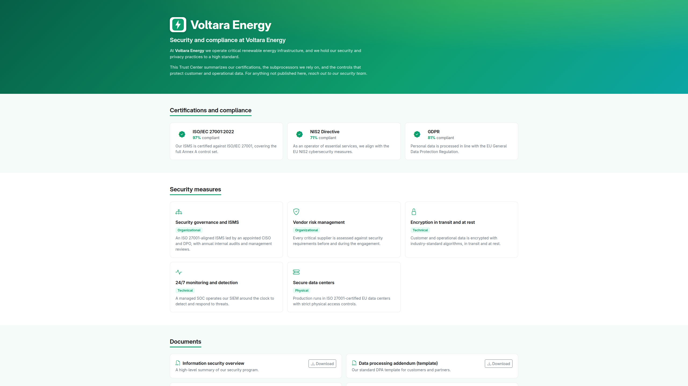

# Trust Center

A public page where you publish your security posture : certifications,
compliance level, subprocessors, security measures and downloadable documents.
It is what you send a prospect's security team instead of filling in their
questionnaire from scratch.

## It is a curation layer, and that is the whole design

Nothing appears on the Trust Center because it exists in Cairn. It appears
because somebody explicitly published it.

That is the opposite of a "public view" toggle, and it is deliberate. Your
internal GRC data includes open nonconformities, unmitigated risks and incident
evidence. A mechanism that could expose any of it by misconfiguration is a
mechanism that eventually will. Here, the only way something becomes public is
that a person chose it, so the failure mode is "we forgot to publish something",
not "we published something we should not have".

## What you can publish

| Item | Notes |
| --- | --- |
| **Certifications** | Drawn from the certificates you hold in [Assets](assets.md#documents), with validity dates |
| **Compliance level** | Your posture against published frameworks |
| **Subprocessors** | The supply-chain transparency GDPR and NIS2 customers ask for |
| **Security measures** | The controls you are willing to describe publicly |
| **Documents** | Downloadable, either open or gated |

## Open and gated documents

An **open** document downloads directly.

A **gated** document requires a request. A visitor submits one, you review it,
and on approval they receive a **signed, time-limited link**. The default
lifetime is seven days, and your administrator can change it.

This is how you publish a penetration test summary or a SOC 2 report without
putting it on the open internet. Requests arrive as notifications and are
handled under Administration -> Trust Center -> Document requests.

## Where it is served

By default the Trust Center lives at `/trust/` on your main hostname.

It can also be served on **its own domain**, for example
`trust.example.com`. In that mode the isolation is real rather than cosmetic :
on that hostname, only the public Trust Center answers. The application, the
admin and the internal API return 404, so the dedicated domain cannot be used as
a way in. Setting this up is an operator task, described in
[configuration](../technical/configuration.md#trust-center-on-its-own-domain).

Public pages are rate-limited.

## Keeping it honest

The Trust Center is the most externally visible thing Cairn publishes, and a
stale one does more damage than none : an expired certificate on a public page
is something a prospect's security team will notice and ask about.

Two habits keep it accurate. Renew certificates in
[Assets -> Documents](assets.md#documents), where the Trust Center reads them
from, rather than editing the public page. And review the published set whenever
your subprocessors change, because that list is one people check.
